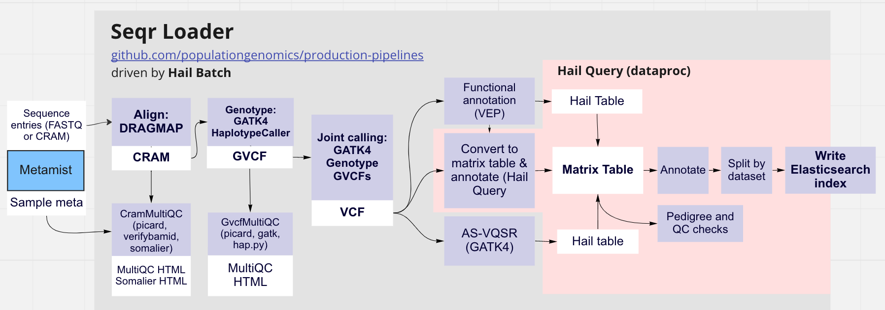
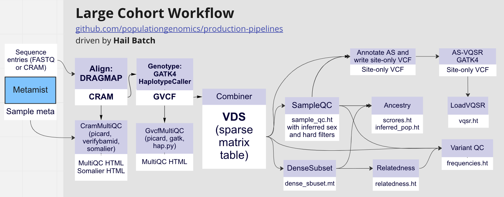
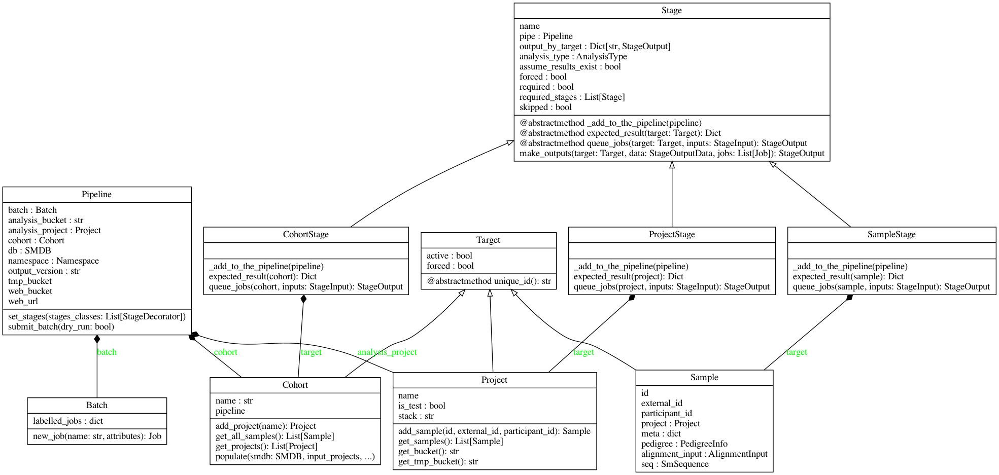

# Hail Batch Workflows

This repository provides implementations of genomics workflows using Hail Batch, specifically:

* WES/WGS Seqr Loader: FASTQ -> CRAM -> GVCF -> pVCF -> Matrix Table -> Elasticsearch index, with an ability to use parts of this pipeline as e.g. a single-sample germline variant calling workflow (FASTQ -> GVCF), joint-calling pipeline (GVCF -> pVCF), AS-VQSR pipeline, etc.
* WES/WGS Large Cohort Workflow: FASTQ -> CRAM -> GVCF -> VDS with Hail Table annotations.
* GATK-SV: CRAM -> VCF and more, orchestrates [GATK-SV WDL workflows](https://github.com/broadinstitute/gatk-sv) in Hail Batch. See [This README](docs/GATK-SV.md) for more information.

## Installation

Requirements:

* [Analysis runner](https://github.com/populationgenomics/analysis-runner)

Clone the repository recursively and change into the repository folder:

```sh
git clone --recurse-submodules git@github.com:populationgenomics/production-pipelines.git
cd production-pipelines
```

## Seqr Loader



Seqr Loader is a combination of the following [WARP](https://github.com/broadinstitute/warp)-inspired workflows:

* Single-sample whole genome and WES germline calling, FASTQ -> GVCF (BWA/DRAGMAP, GATK4 HaplotypeCaller)
* Single-sample calling with re-alignment, CRAM -> GVCF (we use [BAZAM](https://github.com/ssadedin/bazam) to extract FASTQ from CRAM/BAM)
* Whole genome and WES joint-calling, GVCFs -> pVCF
* WES AS-VQSR and WGS VQSR workflows

As well as:

* [The Broad's seqr loading pipelines](https://github.com/broadinstitute/seqr-loading-pipelines)
* [Somalier](https://github.com/brentp/somalier) pedigree checks
* [MultiQC](https://github.com/ewels/MultiQC) QC reporting.

The workflow uses Metamist as a source of FASTQ, CRAMs, and sample/participant metadata, and TOML configs for extended configuration (dataset and sequencing groups, Hail Batch parameters, Elasticsearch credentials, QC thresholds).

### Example usage

To run the Seqr Loader workflow on the dataset called `validation`, create a config file `~/myconfig.toml` as follows:

```toml
[workflow]
input_datasets = ['validation']
sequencing_type = 'genome'
create_es_index_for_datasets = ['validation']
skip_sgs = [
    'CPGXXXX',  # eg: low coverage (8x)
]
```

Submit `main.py seqr_loader` to the analysis runner, and pass along the config above, as well as the `cpg_workflows` Docker image:

```bash
analysis-runner \
  --dataset seqr --description "Seqr Loader" --output-dir "seqr-loader" \
  --access-level full \
  --config ~/myconfig.toml \
  --image australia-southeast1-docker.pkg.dev/cpg-common/images/cpg_workflows:latest \
  main.py \
  seqr_loader
```

Note that you can pass multiple configs to the analysis runner, by repeating the `--config` option multiple times. All config will be merged by the  analysis runner. For more info about configs, see [team-docs](https://github.com/populationgenomics/team-docs/blob/main/cpg_utils_config.md).

For more options available for seqr-loader configuration, check the seqr-loader defaults in [configs/defaults/seqr_loader.toml](configs/defaults/seqr_loader.toml) as well as cpg-workflows defaults in [cpg_workflows/defaults.toml](cpg_workflows/defaults.toml).

### Seqr production load invocation

`configs/seqr-main.toml` provides relevant configuration defaults for a CPG production seqr-loader run. Specifically, in contains the list of datasets to query from Metamist and joint-call together, and a list of blacklisted sequencing groups in those datasets. Another handy configs, `configs/genome.toml` or `configs/exome.toml`, can be passed to subset sequencing groups to WGS or WES specifically. To use along with `configs/seqr-main.toml`, of these two must be provided, as the seqr-loader can work on only one type of data at a time.

For example, to load the genome data:

```sh
analysis-runner \
  --dataset seqr --description "Seqr Loader" --output-dir "seqr-loader" \
  --access-level full \
  --config configs/seqr-main.toml \
  --config configs/genome.toml \
  --image australia-southeast1-docker.pkg.dev/cpg-common/images/cpg_workflows:latest \
  main.py \
  seqr_loader
```

### Stage selection example: only align Seqr sequencing groups

Seqr Loader can be used partially, controlled by `workflows/first_stages`, `workflows/last_stages`, and `workflows/only_stages` parameters.

In order to align data, you only need to trigger the `Align` stage from the workflow (or `CramMultiQC`, if you also want a dataset-level MultiQC report), which can be done with `workflows/last_stages`. So you can create a configuration file like the following:

```toml
[workflow]
last_stages = ['CramMultiQC']
```

And assuming it's named `~/myconfig.toml`, run:

```bash
analysis-runner \
  --dataset seqr --description "CRAM MultiQC" --output-dir "seqr" \
  --access-level full \
  --config configs/seqr-main.toml \
  --config configs/genome.toml \
  --config ~/myconfig.toml \
  --image australia-southeast1-docker.pkg.dev/cpg-common/images/cpg_workflows:latest \
  main.py \
  seqr_loader
```

For exomes, replace `configs/genome.toml` with `configs/exome.toml`, or set `sequencing_type = 'exome'` in the `workflow` section.

The section `workflows/input_datasets` in `configs/seqr-main.toml` specified the list of all projects to be processed, excluding sequencing groups specified in the `workflows/skip_sgs` section.

QC reports for each dataset would be exposed on a web server, e.g. for `validation` genomes, the URL would be https://main-web.populationgenomics.org.au/validation/qc/cram/multiqc.html, and for exomes, it will  be https://main-web.populationgenomics.org.au/validation/exome/qc/cram/multiqc.html.

If samples had pedigree data, a Somalier report will be run to infer and validate participant relationships, with report produced as https://main-web.populationgenomics.org.au/validation/qc/cram/somalier.html

### Stage selection example: create GVCFs and QC variant calls

Run the same command as in the above section, but with the following section in `~/myconfig.toml`:

```toml
[workflow]
last_stages = ['GvcfMultiQC']
```

The genome GVCF QC report will be exposed as https://main-web.populationgenomics.org.au/validation/qc/gvcf/multiqc.html, for `validation` samples it would include a [hap.py](https://github.com/Illumina/hap.py) section with validation stats.

### Stage selection example: upload Elasticsearch indices

If you want the workflow to create Elasticsearch indices in the end, make sure you include the stage `MtToEs` into the workflow (if every prerequisite stage is already finished, you can specify it under `first_stages`), and set the `workflow/create_es_index_for_datasets` section with the list of datasets for which you want the indices to be created:

```toml
[workflow]
first_stages = ['MtToEs']
create_es_index_for_datasets = ['validation']
```

The resulting index will be named using the current datestamp, or using `worfklow/output_version` option if it's specified. The Elasticsearch server is configured using the `elasticsearch` section in `configs/defailts/seqr_loader.toml`. The reason for not automatically creating indices for every project is that the Elasticsearch instance can easily run out of disk space, so additional safeguard is handy.

## Large Cohort Workflow

Another workflow in this repository is [Hail Query](https://hail.is/) workflow for large germline genomic variant calling cohorts.



Large-cohort workflow diverges from seqr-loader after the single-sample `Genotype` stage (which outputs GVCF files). Instead of using GATK for joint genotyping, it uses Hail VCF combiner:

1. Combine GVCFs (generated by GATK4) into a [VDS](https://hail.is/docs/0.2/vds/hail.vds.VariantDataset.html#hail.vds.VariantDataset) format.
2. Perform sample-level QC, including, pedigree, sex and ancestry inference.
3. Perform variant-level QC, including [allele-specific VQSR](https://gatk.broadinstitute.org/hc/en-us/articles/360035890551-Allele-specific-annotation-and-filtering-of-germline-short-variants).

### Usage

Given the config `~/myconfig.toml` is:

```toml
[workflow]
input_datasets = ['validation']
sequencing_type = 'genome'
scatter_count = 20
output_version = '0.1'
```

Run the analysis runner:

```sh
analysis-runner \
  --dataset fewgenomes --description "Larcoh validation" --output-dir "larcoh" \
  --access-level main \
  --config ~/myconfig.toml \
  --image australia-southeast1-docker.pkg.dev/cpg-common/images/cpg_workflows:latest \
  main.py \
  large_cohort
```

The workflow will find inputs using Metamist along with available sample metadata (e.g. known population labels, pedigree), align and call GVCFs, and follow with the VCF combiner and downstream annotation, writing the results into the `gs://cpg-validation-main` bucket.

Note that you can pass multiple configs to the analysis runner, by repeating the `--config` option multiple times. All config will be merged by the analysis runner. For more info about configs, see [team-docs](https://github.com/populationgenomics/team-docs/blob/main/cpg_utils_config.md).

For more options available for the large-cohort workflow configuration, check the defaults in [configs/defaults/large_cohort.toml](configs/defaults/large_cohort.toml), as well as cpg-workflows defaults in [cpg_workflows/defaults.toml](cpg_workflows/defaults.toml).

### Outputs

#### VDS

GVCFs are combined into a [VDS folder format](https://hail.is/docs/0.2/vds/hail.vds.VariantDataset.html#variantdataset) which is writen to `gs://cpg-fewgenomes-test/vds/v0-1.vds`.

#### Sample QC

* Sample-level metadata and QC is written to `gs://cpg-fewgenomes-test/large-cohort/v0-1/sample_qc.ht`, with the following row fields.

Metamist metadata:

```
's': str
'external_id': str
'dataset': str
'gvcf': str
'sex': str
'continental_pop': str
'subcontinental_pop': str
```

[hl.sample_qc](https://hail.is/docs/0.2/methods/genetics.html#hail.methods.sample_qc) annotations:

```
'sample_qc': struct {
    n_het: int64,
    n_hom_var: int64,
    n_non_ref: int64,
    n_singleton: int64,
    n_singleton_ti: int64,
    n_singleton_tv: int64,
    n_snp: int64,
    n_insertion: int64,
    n_deletion: int64,
    n_transition: int64,
    n_transversion: int64,
    n_star: int64,
    r_ti_tv: float64,
    r_ti_tv_singleton: float64,
    r_het_hom_var: float64,
    r_insertion_deletion: float64,
    bases_over_gq_threshold: tuple (
        int64,
        int64,
        int64
    ),
    bases_over_dp_threshold: tuple (
        int64,
        int64,
        int64,
        int64,
        int64
    )
}
```

[Sex imputation](https://hail.is/docs/0.2/methods/genetics.html#hail.methods.impute_sex):

```
'is_female': bool
'var_data_chr20_mean_dp': float64
'chrX_mean_dp': float64
'chrX_ploidy': float64
'chrY_mean_dp': float64
'chrY_ploidy': float64
'X_karyotype': str
'Y_karyotype': str
'sex_karyotype': str
'impute_sex_stats': struct {
    f_stat: float64,
    n_called: int64,
    expected_homs: float64,
    observed_homs: int64
}
```

Soft filters are assigned based on the sample QC (`low_coverage` and `bad_sample_qc_metrics`) and sex imputation results (`sex_aneuploidy` and `ambiguous_sex`):

```
'filters': set<str>
```

Thresholds for sample QC filters are pulled from the config TOML (you can see the default values in [configs/defaults/large_cohort.toml](configs/defaults/large_cohort.toml).

#### Relatedness

[PC-Relate method](https://hail.is/docs/0.2/methods/relatedness.html#hail.methods.pc_relate) is used to identify pairs of the 1st and the 2nd degree relatives (kin coefficient threshold - below which samples are considered unrelated - is specified as `large_cohort.max_kin` in [TOML](configs/defaults/large_cohort.toml)). Pairwise sample relatedness matrix is written as a Hail table index by a tuple of sample IDs: `gs://cpg-fewgenomes-test/large-cohort/v0-1/relatedness.ht`

```
Row fields:
    'i': str
    'j': str
    'kin': float64
    'ibd0': float64
    'ibd1': float64
    'ibd2': float64
----------------------------------------
Key: ['i', 'j']
```

`gs://cpg-fewgenomes-test/large-cohort/v0-1/relateds_to_drop.ht` is a sample-level table which contains related samples to drop, with top ranking sample selected from each family. Sets of unrelated individuals are determined using Hail's [`maximal_independent_set`](https://hail.is/docs/0.2/methods/misc.html?highlight=maximal_independent_set#hail.methods.maximal_independent_set).

```
Row fields:
    's': str
    'rank': int64
----------------------------------------
Key: ['s']
```

### Ancestry

PCA results are written into `gs://cpg-fewgenomes-test/large-cohort/v0-1/ancestry`:
  * `gs://cpg-fewgenomes-test/large-cohort/v0-1/ancestry/eigenvalues.ht`
  * `gs://cpg-fewgenomes-test/large-cohort/v0-1/ancestry/loadings.ht`
  * `gs://cpg-fewgenomes-test/large-cohort/v0-1/ancestry/scores.ht`

When there are samples with known continental population available (the metamist participant metadata field with that data can be specified in the [TOML](configs/defaults/large_cohort.toml) as `large_cohort.training_pop`), a random forest method is used to infer population labels from the PCA results. The method is trained using 16 principal components as features on samples with known ancestry (the number of components can be adjusted in the TOML as well as `large_cohort.n_pcs`). Ancestry was assigned to all samples for which the probability of that ancestry was high enough (the threshold is configured as `large_cohort.min_pop_prob` in the TOML). Results are written as sample-level table `gs://cpg-fewgenomes-test/large-cohort/v0-1/ancestry/inferred_pop.ht`.

```
Row fields:
    's': str
    'scores': array<float64>
    'pop': str
    'is_training': bool
    'pca_scores': array<float64>
----------------------------------------
Key: ['s']
```

Plots for PCA and loadings are written to `gs://cpg-fewgenomes-test-web/large-cohort/v0-1/ancestry/*`, a bucket that is exposed as https://test-web.populationgenomics.org.au/fewgenomes/large-cohort/ancestry/*

#### Dense subset

For PCA and PC-relate, a dense subset of the original dataset is used. The markers for the subset are read from the `references.gnomad.predetermined_qc_variants` Hail table specified in the TOML config. The table is suitable for both exomes and genomes, so that a mixture of different sequencing types can be processed together. The resulting subset is written to `gs://cpg-fewgenomes-test/large-cohort/v0-1/dense-subset.mt`.

### Allele-specific variant quality score recalibration (AS-VQSR)

Variants from good quality samples are filtered using the [AS-VQSR method](https://gatk.broadinstitute.org/hc/en-us/articles/360035531612-Variant-Quality-Score-Recalibration-VQSR-):

1. Variants are exported into a sites-only VCF,

1. Batch jobs are submitted to create SNP and indel recalibration models using the allele-specific version of GATK Variant Quality Score Recalibration [VQSR](https://gatkforums.broadinstitute.org/gatk/discussion/9622/allele-specific-annotation-and-filtering), with the standard GATK training resources (HapMap, Omni, 1000 Genomes, Mills indels), and the following features:

   * SNVs:   `AS_FS`, `AS_SOR`, `AS_ReadPosRankSum`, `AS_MQRankSum`, `AS_QD`, `AS_MQ`,
   * Indels: `AS_FS`, `AS_SOR`, `AS_ReadPosRankSum`, `AS_MQRankSum`, `AS_QD`.

1. The models are applied to the VCFs and combine them back into one VCF.

1. VCF is converted back into a sites-only locus-level Hail table `gs://cpg-fewgenomes-test/large-cohort/v0-1/vqsr.ht`, with split multiallelics.

```
Row fields:
    'locus': locus<GRCh38>
    'alleles': array<str>
    'filters': set<str>
    'info': struct {
        NEGATIVE_TRAIN_SITE: bool,
        POSITIVE_TRAIN_SITE: bool,
        culprit: str
    }
    'a_index': int32
    'was_split': bool
```

Note that the `info.AS-*` annotations used for AS-VQSR are dropped, and only the resulting filter label is appended into the `filters` field, e.g. `VQSRTrancheINDEL99.50to99.90`, `VQSRTrancheSNP99.00to99.90+`, etc. The AS_VQSLOD thresholds for assigning filters are configurable in the [TOML](configs/defaults/large_cohort.toml) as `vqsr.snp_filter_level` and `vqsr.indel_filter_level`.

This pipeline is largely compiled from the following two WDL workflows:

1. `hail-ukbb-200k-callset/GenotypeAndFilter.AS.wdl`

2. The [Broad VQSR workflow](https://github.com/broadinstitute/warp/blob/develop/pipelines/broad/dna_seq/germline/joint_genotyping/JointGenotyping.wdl) documented [here](https://gatk.broadinstitute.org/hc/en-us/articles/360035531112--How-to-Filter-variants-either-with-VQSR-or-by-hard-filtering), translated from WDL with a help of [Janis](https://github.com/PMCC-BioinformaticsCore/janis).

#### Frequencies

Frequencies are calculated using the Hail's [hl.variant_qc](https://hail.is/docs/0.2/methods/genetics.html#hail.methods.variant_qc) method from good quality samples, and written to `gs://cpg-fewgenomes-test/large-cohort/v0-1/frequencies.ht` locus-level table with split multiallelics:

```
Row fields:
    'locus': locus<GRCh38>
    'alleles': array<str>
    'a_index': int32
    'was_split': bool
    'InbreedingCoeff': float64
    'dp_stats': struct {
        mean: float64,
        stdev: float64,
        min: float64,
        max: float64
    }
    'gq_stats': struct {
        mean: float64,
        stdev: float64,
        min: float64,
        max: float64
    }
    'AC': array<int32>
    'AF': array<float64>
    'AN': int32
    'homozygote_count': array<int32>
    'call_rate': float64
    'n_called': int64
    'n_not_called': int64
    'n_filtered': int64
    'n_het': int64
    'n_non_ref': int64
    'het_freq_hwe': float64
    'p_value_hwe': float64
    'p_value_excess_het': float64
----------------------------------------
Key: ['locus', 'alleles']
```

### Applied outputs

Tables generated by the workflow can be applied to a VDS or a split+dense matrix table in the following way:

```python
import hail as hl

vds = hl.vds.read_vds('gs://cpg-fewgenomes-test/vds/v0-1.vds')
sample_qc_ht = hl.read_table('gs://cpg-fewgenomes-test/large-cohort/v0-1/sample_qc.ht')
relateds_to_drop_ht = hl.read_table('gs://cpg-fewgenomes-test/large-cohort/v0-1/relateds_to_drop.ht')
pop_ht = hl.read_table('gs://cpg-fewgenomes-test/large-cohort/v0-1/ancestry/inferred_pop.ht')
vqsr_ht = hl.read_table('gs://cpg-fewgenomes-test/large-cohort/v0-1/vqsr.ht')
freq_ht = hl.read_table('gs://cpg-fewgenomes-test/large-cohort/v0-1/frequencies.ht')

# Row-level tables require a split+dense matrix table:
vds = hl.vds.split_multi(vds, filter_changed_loci=True)
mt = hl.vds.to_dense_mt(vds)

# Hard-filtering samples and variants:
mt = mt.filter_cols(hl.len(sample_qc_ht[mt.col_key].filters) > 0, keep=False)
mt = mt.filter_cols(hl.is_defined(relateds_to_drop_ht[mt.col_key]), keep=False)
mt = mt.filter_rows(hl.len(vqsr_ht[mt.row_key].filters) > 0, keep=False)

# Annotating samples and variants:
mt = mt.annotate_cols(**sample_qc_ht[mt.col_key])
mt = mt.annotate_cols(**pop_ht[mt.col_key])
mt = mt.annotate_rows(**vqsr_ht[mt.row_key])
mt = mt.annotate_rows(**freq_ht[mt.row_key])
```

### References

The workflow is largely inspired by [the Hail pipeline used for the QC of gnomAD releases](https://github.com/broadinstitute/gnomad_qc). Good summaries of gnomAD QC can be found in gnomAD update blog posts:

* [https://macarthurlab.org/2017/02/27/the-genome-aggregation-database-gnomad](https://macarthurlab.org/2017/02/27/the-genome-aggregation-database-gnomad)
* [https://macarthurlab.org/2018/10/17/gnomad-v2-1](https://macarthurlab.org/2018/10/17/gnomad-v2-1)
* [https://macarthurlab.org/2019/10/16/gnomad-v3-0](https://macarthurlab.org/2019/10/16/gnomad-v3-0)
* [https://gnomad.broadinstitute.org/blog/2020-10-gnomad-v3-1-new-content-methods-annotations-and-data-availability/#sample-and-variant-quality-control](https://gnomad.broadinstitute.org/blog/2020-10-gnomad-v3-1-new-content-methods-annotations-and-data-availability/#sample-and-variant-quality-control)
* [https://blog.hail.is/whole-exome-and-whole-genome-sequencing-recommendations/](https://blog.hail.is/whole-exome-and-whole-genome-sequencing-recommendations/)

## GATK-SV

Broad's [GATK-SV workflow](https://github.com/broadinstitute/gatk-sv) is WIP, but it can be already used to call SV evidence from individual samples.

Under the hood, the workflow invokes the GATK-SV WDL workflow using a managed Cromwell instance via the analysis runner helper functions. The WDL workflow repository is [forked](https://github.com/populationgenomics/gatk-sv), and the latest commit to use is specified in `gatk_sv/gatk_sv.py` as a `GATK_SV_COMMIT` constant.

### Building reference and dockers

Running the workflow requires the Broad reference data copied to a `workflow/reference_prefix` bucket, and images copied to `workflow/image_registry_prefix`. In order to do that, use the following scripts:

```bash
bash sync_references.sh
python sync_images.py
```

The latter script will print a section for the `gatk-sv.toml` `[images]` section, that you'd need to insert there to make sure the workflow points to the latest tags. Also, when updating the GATK-SV fork, double check that the `[references.broad.sv.*]` sections in the config are up-to-date as well, and add new missing reference files if there are any.

## Development

### Dev installation

Assuming `python3` points to `python3.10`, set up a virtual environment:

```sh
python3 -m pip install virtualenv
virtualenv venv
source venv/bin/activate
```

Install the package, and the development environment:

```bash
pip install -e .
pip install -r requirements-dev.txt
```

### Codebase

The entry point of the codebase is `main.py` script. It contains `WORKFLOWS` dictionary, which is listing all available workflows. A workflow is defined by the final stages it needs to trigger, with each stage pulling other required stages recursively following `required_stages` links. Those final stages are passed to the `run_workflow()` function, which would orchestrate stages and required inputs.

In this documentation section, we describe in more detail how exactly it's implemented.

### `cpg_workflows` library

[Hail Batch](https://hail.is/#hail-batch) is a powerful system for workflow programming and execution using cloud compute and storage. In CPG, we manage our own Hail Batch deployment, along with the [analysis-runner](https://github.com/populationgenomics/analysis-runner) tool that provides an approachable and secure way to submit analysis scripts to Hail Batch.

In Hail, the workflows can be described using Python, and be built to be parts of more complex applications. E.g. the analysis-runner uses Hail Batch to drive itself, and the genomic variation analysis tool called Hail Query can use Hail Batch as a backend. All that makes Hail Batch a natural choice to design genomics workflows.

Classical genomics best-practices workflow implementations like [WARP](https://github.com/broadinstitute/warp) and [GATK-SV](https://github.com/broadinstitute/gatk-sv) use WDL to be run with [Cromwell](https://github.com/broadinstitute/cromwell) or Terra. In order to integrate WDL workflows into a Hail Batch infrastructure, there are a few possible approaches.

1. Start a Cromwell instance as part of Hail Batch job script, and submit a sub-workflow inside that job,
2. Maintain a managed Cromwell instance, and wrap only workflow submissions in a Hail Batch job,
3. Fully re-engineer WDL workflows in Python and Hail Batch.

For the GATK-SV workflow, we went with the approach #2. The workflow is quite complex, it uses many layers of branching nested sub-workflows, and it implements even minor file processing commands as separate WDL tasks. We also do not intend to adjust this workflow much as of now. In order to run GATK-SV, we support a managed Cromwell instance along with a [Python helper](https://github.com/populationgenomics/analysis-runner/blob/main/analysis_runner/cromwell.py#L230) that wraps interaction with Cromwell using Hail Batch jobs, and we utilize Cromwell API along with [Swagger](https://cromwell.populationgenomics.org.au/swagger/index.html?url=/swagger/cromwell.yaml#/Workflows/metadata) to explore Cromwell logs.

As for the WGS/WES germline variant workflows, we re-engineered them fully in Hail Batch, largely inspired by WARP, but with significant divergence from WARP: we added dataset-specific pedigree checks and dataset-specific MultiQC reports, allele-specific VQSR for WGS, cohort annotation using Hail Query and exporting to the Elasticsearch using scripts from [seqr-loading-pipelines](https://github.com/broadinstitute/seqr-loading-pipelines). There are also several CPG-specific layers, like reading inputs and metadata from [Metamist](https://github.com/populationgenomics/sample-metadata); reporting analysis results back to Metamist; setting global configuration with TOML; and a necessity for a more fine-grained tuning of tool's parameters and compute resources.

To facilitate re-engineering WARP workflows and creating workflows scratch, we implemented some abstractions in this module, namely a workflow "stage" with expected inputs, outputs, and dependencies, and "stage" target ("sample", "dataset", "cohort"). Unlike WDL's concept of nested sub-workflows, Hail Batch is intrinsically lower-level, naturally providing one layer of jobs, with each job corresponding to on bash script that is run on one cloud VM. That doesn't always match a higher-level task in the application domain. For example, a workflow stage called "genotype" can include multiple jobs to generate calling intervals, partition inputs, run the genotyping tool in parallel instances, gather results, perform post-processing and filtering. That "stage" would sit between an "alignment" stage and a "joint calling" stage, and a user might need to start a workflow from a specific stage, reusing pre-existing outputs; or run the pipeline only up to a specific stage. So it's helpful to abstract a set of jobs related in a domain-specific way as a stage, with an ability to restart/skip/select stages. It also turns out that GATK-SV facilitates from these abstractions too, as it consists of multiple disconnected sub-workflows of different levels.

### Stages



This library provides an abstraction interface on top of Hail Batch jobs, namely a `Stage` abstract class, parametrised by the `Target` abstract class, representing what target this stage works with.

For example, a stage that performs read alignment to produce a CRAM file, would be derived from `SequencingGroupStage`, and be parametrised by `SequencingGroup`, and a stage that performs joint-calling would be derived from `CohortStage`, parametrised by `Cohort`.

Each `Stage` final implementation must declare paths to the outputs it would write in the `expected_outputs()` method. It must also define how jobs are added into Hail Batch using the `queue_jobs()` method.

For example, out "Align" stage that runs BWA might look like as following:

```python
from cpg_utils import Path
from cpg_workflows.workflow import stage, SequencingGroupStage, SequencingGroup, StageInput, StageOutput
from cpg_utils.hail_batch import get_batch

@stage
class Align(SequencingGroupStage):
    def expected_outputs(self, sequencing_group: SequencingGroup) -> Path:
        return sequencing_group.make_cram_path().path

    def queue_jobs(self, sequencing_group: SequencingGroup, inputs: StageInput) -> StageOutput | None:
        j = get_batch().new_job('BWA', self.get_job_attrs(sequencing_group))
        j.command(f'bwa ... > {j.output}')
        get_batch().write_output(j.output, str(self.expected_outputs(sequencing_group)))
        # Construct StageOutput object, where we pass a path to the results,
        return self.make_outputs(sequencing_group, self.expected_outputs(sequencing_group), [j])
```

The `queue_jobs()` method is expected to return an output of type `StageOutput`: you can call `self.make_outputs()` to construct that object.

Stages can depend on each other (i.e. they form a directed acyclic graph), which is specified using a parameter `required_stages` to the `@stage` class decorator, and the `inputs` parameter in `queue_jobs()` to get the output of a previous stage. E.g. our sequencing group genotyping stage might look like this:

```python
from cpg_utils import Path
from cpg_workflows.workflow import stage, SequencingGroupStage, SequencingGroup, StageInput, StageOutput

Align = ...


@stage(required_stages=Align)
class Genotype(SequencingGroupStage):
    def expected_outputs(self, sequencing_group: SequencingGroup) -> Path:
        return sequencing_group.make_gvcf_path().path

    def queue_jobs(self, sequencing_group: SequencingGroup, inputs: StageInput) -> StageOutput | None:
        jobs = ...
        return self.make_outputs(sequencing_group, self.expected_outputs(sequencing_group), jobs)
```

Stage of different levels can depend on each other, and the library will resolve that correctly. E.g. joint calling stage that takes GVCF outputs to produce a cohort-level VCF would look like this:

```python
from cpg_utils import Path
from cpg_workflows.workflow import stage, CohortStage, Cohort, StageInput, StageOutput

Genotype = ...


@stage(required_stages=Genotype)
class JointCalling(CohortStage):
    def expected_outputs(self, cohort: Cohort) -> Path:
        return cohort.analysis_dataset.prefix() / 'joint-called.vcf.gz'

    def queue_jobs(self, cohort: Cohort, inputs: StageInput) -> StageOutput | None:
        # Get outputs from previous stage. Because the Genotype stage
        # acts on a sequencing_group, we use a method `as_path_by_target` that returns
        # a dictionary index by sequencing group ID:
        gvcf_path_by_sg = inputs.as_path_by_target(Genotype)
        assert len(gvcf_path_by_sg) == len(cohort.get_sequencing_groups())
        jobs = ...
        return self.make_outputs(cohort, self.expected_outputs(cohort), jobs)
```

To submit a set of defined stages to Hail Batch, just call the `run_workflow(stages)` method:

```python
from cpg_workflows.workflow import run_workflow
JointCalling = ...
run_workflow().run(stages=[JointCalling])
```

It takes a list of stage classes as a single parameter, and it would resolve all implicit dependencies automatically.

### Configuration

The library implicitly reads configuration using the `cpg_utils.config.get_config()` from a TOML file specified in the `CPG_CONFIG_PATH` environment variables, which are passed via the analysis runner's `--config` flag. For example, you can prepare a TOML config file `config.toml` as follows:

```toml
[workflow]
sequencing_type = 'genome'
only_datasets = ['hgdp', 'thousand-genomes']
skip_sgs = ['CPGXXXX', 'CPGXXXX']
skip_stages = ['Align']
check_inputs = true  # checks e.g. if fastq for align stage exist
check_intermediates = false  # explitic calls to can_reuse(path) will return False
check_expected_outputs = true  # if expected_outputs() exist, skip stage
```

And execute the workflow script `main.py` with the analysis-runner as follows:

```bash
analysis-runner --dataset seqr --access-level test -o test-workflow \
--config configs/config.toml main.py
```

The script would be able to access config parameters with

```python
from cpg_utils.config import get_config
assert get_config()['workflow']['sequencing_type'] == 'genome'
```

Note that the workflow implicitly reads inputs from Metamist, and requires `workflow/only_datasets` and `workflow/sequencing_type` to be defined to pull proper inputs.

TOML files in [configs/defaults](configs/defaults) and [cpg_workflows/defaults.toml](cpg_workflows/defaults.toml) list possible configuration parameters for workflows, please refer to those configs for documentation.

Also keep in mind that analysis-runner would implicitly set a set of config parameters suitable specifically for the CPG infrastructure, e.g. the generated config after analysis-runner post-processing would look like this:

```toml
[workflow]
access_level = "test"
dataset_gcp_project = "validation"
dataset = "validation"

[hail]
billing_project = "validation"
pool_label = "large-cohort"

[images]
cpg_workflows = "australia-southeast1-docker.pkg.dev/cpg-common/images/cpg_workflows:1.4.1"
bcftools = "australia-southeast1-docker.pkg.dev/cpg-common/images/bcftools:1.16"
...

[references]
genome_build = "GRCh38"
vep_mount = "gs://cpg-common-main/references/vep/105.0/mount"
...

[references.broad]
dragmap_prefix = "gs://cpg-common-main/references/hg38/v0/dragen_reference"
...

[storage.default]
default = "gs://cpg-validation-main"
web = "gs://cpg-validation-main-web"
analysis = "gs://cpg-validation-main-analysis"
tmp = "gs://cpg-validation-main-tmp"
web_url = "https://main-web.populationgenomics.org.au/validation"
...
```

If you are not using the analysis runner, you'd have to set those generated values explicitly.

### Batch helpers

The `cpg_utils.hail_batch` module provides a helper function `get_batch` to set up Hail Batch in the CPG context, assuming `hail/billing_project` and `hail/backend` are set in config.

```python
from cpg_utils.hail_batch import get_batch
b = get_batch(name='My batch')
j = b.new_job('My job', ...)
...
```

The Batch instance derives from a class extended from standard Hail `Batch` class, and it records stats of added jobs and prints statistics before submission, highlighting labelled jobs, e.g.:

```sh
Will submit 186 jobs:
BWA: 3 for 3 samples
Somalier extract (CRAMs): 3 for 3 samples
HaplotypeCaller: 3 for 3 samples
ReblockGVCF: 3 for 3 samples
Somalier extract (GVCFs): 3 for 3 samples
Other jobs: 171
```

The Batch instance also constructs the job name if the names of a sample and a dataset are provided as attributes, e.g.:

```bash
>>> j = b.new_job('My job', dict(sequencing_group='CPGXXXX', dataset='fewgenomes'))
>>> print(j.name)
fewgenomes/CPGXXXX: My job
```

`cpg_utils.hail_batch` provides a helper `command` to set up a command that can be used to add monitoring of disk space, or authenticate with GCP:

```python
from cpg_utils.hail_batch import command
j = ...
j.command(command('sleep 600', monitor_space=True, setup_gcp=True))
```

This will wrap the command as follows:

```bash
set -o pipefail
set -ex
export GOOGLE_APPLICATION_CREDENTIALS=/gsa-key/key.json
gcloud -q auth activate-service-account --key-file=$GOOGLE_APPLICATION_CREDENTIALS

(while true; do df -h; du -sh $BATCH_TMPDIR; sleep 600; done) &

sleep 600

df -h; du -sh $BATCH_TMPDIR
```

### Reusing existing results

`workflow/check_expected_outputs = true` controls whether the paths returned by `expected_outputs()` of each job correspond to existing objects, and would skip stages with already existing outputs.

You can also call the method `cpg_workflows.utils.can_reuse(path)` explicitly within the code called from `queue_jobs()`.
`workflow/check_intermediates = true` controls whether `can_reuse()` checks the object(s), or always returns `False`.

`workflow/check_inputs = true` controls whether inputs to the first stage in the pipeline should be checked for existence, e.g. alignment inputs for an `Align` stage. `skip_sgs_with_missing_input` controls the behaviour if those inputs are missing: where skip such sequencing groups, or stop the workflow.

You can also start the pipeline from a specific stage with `workflow/first_stages` (it would skip all previous stages, but still check immediately required inputs for the first stage). `workflow/last_stages` would stop the workflow after the stages specified. `workflow/only_stages` would execute only stages specified, ignoring dependencies.

You can also force the pipeline to skip certain sequencing groups with `workflow/skip_sgs`, pick only certain sequencing groups with `workflow/only_sgs`, force re-processing of certain sequencing groups with `workflow/force_sgs`. `workflow/skip_datasets` and `workflow/only_datasets` are available, and more fine-grained combination of `skip_sgs` and `skip_stages`:

```toml
[workflow.skip_stages_for_sgs]
CramQC = ['CPGXXXX']
```

### Available stages

To see available workflow stages, explore the `cpg_workflows/stages` folder. A stage wrappers for Hail Batch jobs that allow to glue them together into genomics workflows. `cpg_workflows` also provides helper functions that create Hail Batch jobs for different domain-specific applications, e.g. alignment, deduplication, QC, variant calling, creating calling intervals, running VQSR, creating ES index, etc. Those jobs can be called from the `queue_jobs` method of a stage, or in isolation, as they don't need to know about the stage they are called from, but only need a `Batch` object.


### Slack QC notifications

Config's `[slack]` section activates QC reports to a Slack channel. For example:

```toml
[slack]
channel = 'workflows-qc'
token_secret_id = 'slack-seqr-loader-token'
token_project_id = 'seqr-308602'
```

Would send messages on QC completion to the `workflows-qc` channel, flagging failed samples.

Two scripts send Slack messages: `check_multiqc.py` and `check_pedigree.py`. Note that the MultiQC checks only work when the `qc_thresholds` section is also specified, for example:

```toml
[qc_thresholds.genome.min]
"MEDIAN_COVERAGE" = 10
"PCT_PF_READS_ALIGNED" = 0.80
[qc_thresholds.genome.max]
"FREEMIX" = 0.04
"PERCENT_DUPLICATION" = 25
```

Thresholds can be adjusted as needed, per workflow or dataset. Note that the metrics names here should match the ones in the MultiQC JSON.
