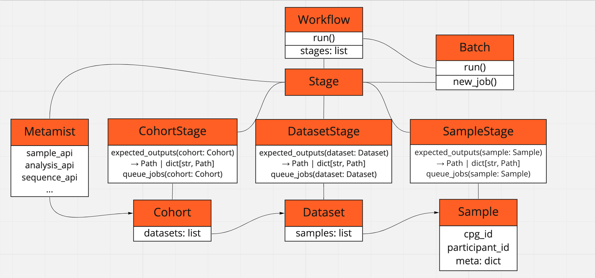

# Production pipelines

## cpg_pipes python package

The `cpg_pipes` package provides Python functions that help to design a pipeline powered by [Hail Batch](https://hail.is/docs/batch/service.html).

### Installation

Requires Python 3.10

```bash
pip install cpg_pipes
```

### Motivation

A pipeline can be represented as a set of stages with dependency interrelationships (i.e. a directed acyclic graph of stages). Hail Batch has a concept of jobs that can depend on each other; however, a Hail Batch job corresponds to only one bash script that is run on a cloud VM, which doesn't always solve a higher-level task in the application domain. In contrast, a pipeline stage called "genotype" can include multiple jobs that generate intervals, partition input, run a genotyping tool on each partition in parallel, gather outputs, and perform some post-processing. A user might want to treat it as one "stage" that sits between an "alignment" stage and a "joint calling" stage.

At the CPG, we also want to permanently record outputs of some stages (e.g. individual CRAM and GVCF files, fingerprints, a joint-called matrix table). Specifically, we store those results on buckets according to the storage policy and add entries into the sample metadata database. When rerunning a pipeline, we want to explicitly control whether to reuse existing results. We also want to be able to start the pipeline from a specific stage, making the pipeline assume that all previous stages have finished successfully; or run the pipeline only up to a specific stage.

Motivated by that, we designed the `cpg_pipes` package. It implementes a concept of `Stage` that can act on a `Target`: e.g. a `Sample`, a `Project`, or a `Cohort`. For example, a stage that performs read alignment to produce a CRAM file would act on a sample, and a stage that performs joint-calling would act on an entire cohort. 

Each stage declares paths to the outputs it would produce by implementing the abstract `expected_outputs()` method; and it also defines how jobs are added into Hail Batch using the `queue_jobs()` method. 

Overall classes and object relationships look as follows:



### Building pipelines

To declare a stage, derive a class from `SampleStage`, `ProjectStage`, or `CohortStage`, implement the abstract methods, and wrap the class with a `@stage` decorator:

```python
from cpg_pipes.pipeline import stage, StageInput, StageOutput, SampleStage
from cpg_pipes.targets import Sample
from cpg_pipes import Path, to_path


@stage
class Align(SampleStage):
    """Stage that runs read alignment"""

    def expected_outputs(self, sample: Sample) -> Path:
        """Returning a path to a CRAM file that will be generated"""
        return to_path('gs://cpg-thousand-genomes-test/cram/NA12878.cram')

    def queue_jobs(self, sample: Sample, inputs: StageInput) -> StageOutput | None:
        """Defines how jobs are added into a batch object"""
        cram_path = self.expected_outputs(sample)
        # This Job just writes the sample name to a file:
        j = self.pipe.b.new_job(f'Align {sample.id}')
        # Just writing a sample name for a demonstration:
        j.command(f'echo {sample.id} > {j.output}')
        self.pipe.b.write_output(j.output, cram_path)
        # Construct StageOutput object, where we pass a path to the results, 
        # and all added jobs:
        return self.make_outputs(sample, data=cram_path, jobs=[j])
```

The `queue_jobs` method is expected to return an output of type `StageOutput`: you can call `self.make_outputs()` to construct that object.

Stages can depend on each other. Use the `required_stages` parameter to `@stage` to set dependencies, and use the `inputs` parameter in `queue_jobs` to get the output of a previous stage:

```python
from cpg_pipes.pipeline import stage, StageInput, StageOutput, SampleStage
from cpg_pipes.targets import Sample


@stage(required_stages=[Align])
class ReadCramFile(SampleStage):
    """Stage that reads the CRAM file genereated by a Align stage"""

    def queue_jobs(self, sample: Sample, inputs: StageInput) -> StageOutput | None:
        # Read the `Align` stage outputs:
        cram_path = inputs.as_path(sample, stage=Align)
        return ...
```

Stage of differnet levels can depend on each other, and `cpg_pipes` will resolve that correctly. E.g. joint-calling taking GVCF outputs to produce a cohort-level VCF:

```python
from cpg_pipes.pipeline import stage, StageInput, StageOutput, SampleStage,
    CohortStage
from cpg_pipes.targets import Sample, Cohort


@stage
class HaplotypeCaller(SampleStage):
    """Stage that runs gatk Haplotype caller to generate a GVCF for a sample"""

    def queue_jobs(self, sample: Sample, inputs: StageInput) -> StageOutput | None:
        jobs = ...
        return self.make_outputs(sample, data=self.expected_outputs(sample), jobs=jobs)


@stage(required_stages=HaplotypeCaller)
class JointCalling(CohortStage):
    """Stage that runs joint calling on GVCFs"""

    def queue_jobs(self, cohort: Cohort, inputs: StageInput) -> StageOutput | None:
        # Get outputs from previous stage. Because the HaplotypeCaller stage
        # acts on a sample, we use a method `as_path_by_target` that returns
        # a dictionary index by sample ID:
        gvcf_by_sample_id = inputs.as_path_by_target(stage=HaplotypeCaller)
        job = ...
        return self.make_outputs(cohort, data=self.expected_outputs(cohort), jobs=[job])

    ...
```

To submit the constructed pipeline to Hail Batch, create a pipeline with `create_pipeline`, and call `submit_batch()`. You need to pass a name, a description, a version of a run, the namespace according to the storage policies (`test` / `main` / `tmp`), and the `analysis_dataset` name that would be used to communicate with the sample metadata DB.

```python
from cpg_pipes.pipeline import create_pipeline
from cpg_pipes import Namespace

pipeline = create_pipeline(
    name='my_pipeline',
    description='My pipeline',
    namespace=Namespace.TEST,
    analysis_dataset='fewgenomes',
)
pipeline.run()
```

### Input sources

Class `cpg_pipes.providers.InputProvider` provides an interface for an input data provider, with two implementations: `CsvInputProvider` and `SmdbInputProvider`. The former one allows you to specify inputs in a CSV file. E.g.:

```
$ cat inputs.tsv
dataset,sample,external_id,fqs_r1,fqs_r2,cram,sex
hgdp,NA12878,NA12878,NA12878_R1.fq.gz|NA12878_R2.fq.gz,,F
hgdp,NA12879,NA12879,NA12879_R1.fq.gz|NA12879_R2.fq.gz,,M
```

```python
from cpg_pipes.providers import InputProviderType
from cpg_pipes.pipeline import create_pipeline

pipeline = create_pipeline(
    ...,
    input_provider_type=InputProviderType.CSV,
    input_csv='inputs.csv',
)
```

`SmdbInputProvider` allows to pull input data from the CPG [sample metadata database](https://github.com/populationgenomics/sample-metadata):

```python
from cpg_pipes.providers import InputProviderType
from cpg_pipes.pipeline import create_pipeline

pipeline = create_pipeline(
    ...,
    datasets=['hgdp'],
    input_provider_type=InputProviderType.CPG,
)
```

The defailt input provider type is `InputProviderType.NONE`, which means that no samples and datasets are loaded, but you can add them manually into the automatically created `cohort` object:

```
>>> pipeline.cohort.get_datasets()
['hgdp']

>>> for dataset in pipeline.cohort.get_datasets():
>>>     samples = dataset.get_samples()
>>>     print(samples[0])
Sample(id='CPG68197', external_id='HGDP00001', dataset=Dataset("hgdp"), meta={}, alignment_input=CramPath('gs://cpg-nagim-test/cram/HGDP00001.cram'), pedigree=None),
...
```

If a `Participant` entry is available, `sample.participant_id` will be populated. If a corresponding `Sequence` is available, `reads` metadata will be parsed and populated as `sample.alignment_input`, along with `sample.sequencing_type`. If corresponding `Analysis` entries exist, they will be populated as `sample.sanalysis_by_type`. If `Family` data is available, it will be parsed and populated as `sample.pedigree`.

### Storage policies

Outputs are written according to provided storage policy. Class `cpg_pipes.providers.StoragePolicy` provides an interface for abstract policy, with one implementation: `CpgStoragePolicy`, which implements the [CPG storage policy](https://github.com/populationgenomics/team-docs/tree/main/storage_policies). The default cloud storage provider is Google Cloud Storage, which can be overridden with `cloud` parameter to `create_pipeline` (or `--cloud <val>` in the command line).

### Bioinformatics jobs

The `cpg_pipes.jobs` module defines functions that create Hail Batch Jobs for different bioinformatics purposes: alignment, fastqc, deduplication, variant calling, VQSR, etc. E.g. to implement the joint calling stage above, you can use:

```python
from cpg_pipes.pipeline import stage, SampleStage, CohortStage, StageInput, StageOutput
from cpg_pipes.targets import Sample, Cohort
from cpg_pipes.jobs import haplotype_caller, joint_genotyping
from cpg_pipes.types import CramPath, GvcfPath


@stage
class HaplotypeCaller(SampleStage):
    """Stage that runs gatk HaplotypeCaller to produde a GVCF"""

    def queue_jobs(self, sample: Sample, inputs: StageInput) -> StageOutput | None:
        """Call the function from the jobs module"""
        cram_path = inputs.as_path(target=sample, stage=Align)
        expected_path = self.expected_outputs(sample)
        jobs = haplotype_caller.produce_gvcf(
            b=self.pipe.b,
            sample_name=sample.id,
            cram_path=CramPath(cram_path),
            output_path=expected_path,
            scatter_count=50,
            tmp_prefix=sample.dataset.tmp_prefix(),
            refs=self.refs,
            sequencing_type=sample.sequencing_type,
        )
        return self.make_outputs(sample, data=expected_path, jobs=jobs)


@stage(required_stages=HaplotypeCaller)
class JointCalling(CohortStage):
    """Stage that runs joint calling on GVCFs"""

    def queue_jobs(self, cohort: Cohort, inputs: StageInput) -> StageOutput | None:
        """Call the function from the jobs module"""
        gvcf_by_sid = {
            sample.id: GvcfPath(inputs.as_path(target=sample, stage=HaplotypeCaller))
            for sample in cohort.get_samples()
        }
        jobs = joint_genotyping.make_joint_genotyping_jobs(
            b=self.pipe.b,
            out_vcf_path=self.expected_outputs(cohort)['vcf'],
            out_siteonly_vcf_path=self.expected_outputs(cohort)['siteonly_vcf'],
            gvcf_by_sid=gvcf_by_sid,
            refs=self.refs,
            sequencing_type=cohort.get_sequencing_type(),
            tmp_bucket=cohort.analysis_dataset.tmp_prefix(),
        )
        return self.make_outputs(cohort, data=self.expected_outputs(cohort), jobs=jobs)
```

Available jobs include alignment:

```python
from cpg_pipes.jobs import align

sample = ...
j = align.align(
    b=...,
    alignment_input=sample.alignment_input,
    output_path=...,
    realignment_shards_num=10
)
```

Getting intervals for sharding variant calling:

```python
from cpg_pipes.jobs import split_intervals
j, intervals = split_intervals.get_intervals(b=..., scatter_count=20)
```

Generate somalier pedigree fingerprints:

```python
from cpg_pipes.jobs import somalier
fingerprint_job, fingerprint_path = somalier.extact_job(
    b=...,
    gvcf_or_cram_or_bam_path=...,
    refs=...,
)
```

Infer pedigree relashionships and sex of samples in a dataset, and check with a probided PED file:

```python
from cpg_pipes.jobs import somalier
dataset = ...
j, somalier_samples_path, somalier_pairs_path = somalier.ancestry(
    b=...,
    dataset=...,
    refs=...,
    input_path_by_sid=...,
    out_tsv_path=...,
    out_html_path=...,
    out_html_url=...,
)
```

VQSR (from a site-only VCF or a Hail matrix table):

```python
from cpg_pipes.jobs import vqsr
cohort = ...
j = vqsr.make_vqsr_jobs(
    b=...,
    input_vcf_or_mt_path=...,
    gvcf_count=len(cohort.get_samples()),
    out_path=...,
    refs=...,
    sequencing_type=cohort.get_sequencing_type(),
    tmp_prefix=cohort.tmp_prefix(),
    use_as_annotations=True,
)
```

There other jobs available - refer to the code examples.

### Pipelines

There are full pipelines available in the `pipelines` folder, specifically:

- `pipelines/seqr_loader.py` takes CRAM/FASTQ, aligns and joint-genotypes, then annotates using Hail Query and creates an Elasticsearch index for Seqr.
- `pipelines/somalier.py` uses Somalier and an input PED file to check pedigree and sex of CRAMs or GVCFs,
- `pipelines/qc.py` takes CRAMs and runs CRAM QC and summarises it in a MultiQC report,
- `pipelines/cram_gvcf.py` takes CRAM/FASTQ, and runs alignment and genotyping for each sample,
- `pipelines/gatk_sv` orchestrates workflows of [GATK-SV](https://github.com/populationgenomics/gatk-sv).

### Click options

The `cpg_pipes/pipeline/cli_opts.py` module provides CLI options for Click that handles default parameters that can be used to customise a pipeline. The basic usage is as follows:

```python
import click
from cpg_pipes.pipeline import create_pipeline, pipeline_entry_point


@click.command()
@pipeline_entry_point
def main(**kwargs):
    pipeline = create_pipeline(
        name='my_pipeline',
        description='My pipeline',
        **kwargs,
    )
```

When calling such a pipelne script from the command-line, the options defined in `@pipeline_click_options` will be available and passed to the `create_pipeline` factory.

You can add more custom options like this:

```python
import click
from cpg_pipes.pipeline import pipeline_entry_point, create_pipeline


@click.command()
@pipeline_entry_point
@click.option('--custom-option')
def main(**kwargs):
    custom_option = kwargs.pop('custom_option')
    pipeline = create_pipeline(
        name='my_pipeline',
        description='My pipeline',
        **kwargs,
    )
```

### Batch helpers

The `cpg_pipes.hb.batch` module provides a helper function `setup_batch` to set up Hail Batch in the CPG context:

```python
from cpg_pipes.hb.batch import setup_batch
b = setup_batch('My batch')
```

It will create an instance of Batch that extends the standard Hail Batch, that records stats of added jobs and prints statistics before submission, highlighting labelled jobs, e.g.:

```
Will submit 186 jobs:
  BWA: 3 for 3 samples
  Somalier extract (CRAMs): 3 for 3 samples
  HaplotypeCaller: 3 for 3 samples
  ReblockGVCF: 3 for 3 samples
  Somalier extract (GVCFs): 3 for 3 samples
  Other jobs: 171
```

The Batch instance also constructs the job name if the names of a sample and a dataset are provided as attributes, e.g.:

```bash
>>> j = b.new_job('My job', dict(sample='CPG196535', dataset='fewgenomes'))
>>> print(j.name)
fewgenomes/CPG196535: My job
```

`cpg_pipes.hb.command` provides a helper to set up a command that can be used to add monitoring of disk space, or authenticate with GCP to make `gsutil` work:

```python
from cpg_pipes.hb.command import wrap_command
b = ...
j = b.new_job('My job')
j.command(wrap_command(
    'sleep 600',
    monitor_space=True,
    setup_gcp=True,
))
```

This will wrap the command as follows:

```
set -o pipefail
set -ex
export GOOGLE_APPLICATION_CREDENTIALS=/gsa-key/key.json
gcloud -q auth activate-service-account --key-file=$GOOGLE_APPLICATION_CREDENTIALS

(while true; do df -h; du -sh /io; du -sh /io/batch; sleep 600; done) &

sleep 600

df -h; du -sh /io; du -sh /io/batch
```

### Reusing existing results

By default, if expected result exist, empty jobs will be submitted suffixed with ` [reuse]`. You can disable that check with `--no-check-expected-outputs`.

You can also start from a specific stage with `--first-stage`, or finish on specific one with `--last-stage`.

You can use `@skip` decorator to force skipping a stage:

```python
from cpg_pipes.pipeline import stage, skip, SampleStage

@skip(reason='Stage is not needed')
@stage
class MyStage1(SampleStage):
    ...
```

`assume_outputs_exist=True` would also tell the code that the expected results of that stage exist, and there is no need to check bucket objects for existence:

```python
from cpg_pipes.pipeline import stage, skip, SampleStage

@skip
@stage(assume_outputs_exist=True)
class MyStage2(SampleStage):
    ...
```

You can also force the pipeline to skip certain samples with `--skip-samples/-S`, or take only certain samples with `--only-samples/-s`, or force processing certain samples with `--force-samples`.

### Running pipelines

To start the `seqr_loader` pipeline on 2 datasets `acute-care` and `perth-neuro` in the test namespace, using `seqr` as analysis dataset, and write the Elasticsearch index for `perth-neuro`:

```sh
python pipelines/seqr_loader.py \
-n main \
--analysis-dataset seqr \
--dataset acute-care \
--dataset perth-neuro \
--skip-sample CPG11783 \
--skip-sample CPG13326 \
--keep-scratch
```

Alternatively, you can put the command line options into a config YAML file:

```sh
python pipelines/seqr_loader.py --config pipelines/configs/seqr.yml
```

Another useful pipeline is `pipelines/somalier.py` to verify inferred sample
relatedness and sex against a provided PED file(s):

```sh
python pipelines/somalier.py --config pipelines/configs/seqr.yml
```
